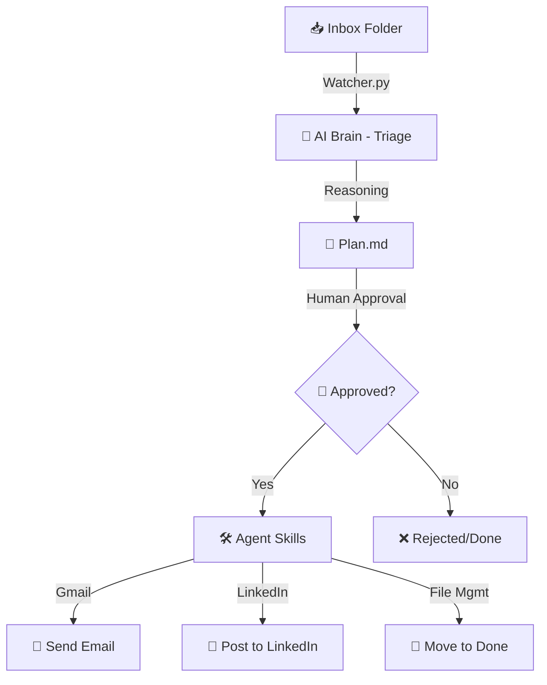

# 🤖 AI Employee Agent Factory
### *A Production-Ready Personal AI Employee System*

---

## 🎯 The Vision
Build a fully autonomous "Employee in a Box" using **Claude Code** as the brain, **Obsidian** as the memory, and **Python** as the hands.

---

## 🏗️ System Architecture
The following diagram illustrates how tasks flow through the system:

---

## 🧱 The Foundation (Bronze Tier)
*Built for reliability and basic automation.*

- **Obsidian Vault**: A structured knowledge base with clear boundaries.
- **FS Watcher**: Real-time monitoring of triggers (Inbox).
- **File Triage Skill**: Basic procedural logic to categorize work.

---

## 🥈 The Brain (Silver Tier)
*Built for production-level autonomy.*

### 🔍 Reasoning Loop
Before any action, the AI creates a comprehensive `Plan.md` outlining its objective and steps.

### 🎭 Modular Skills
| Skill | Capability |
| :--- | :--- |
| **Email** | SMTP-based secure communication. |
| **Social** | Browser-automated LinkedIn publishing. |
| **Safety** | Human-in-the-loop approval system. |
| **Orchestration** | Automatic task movement and filing. |

---

## 🚀 Future Roadmap (Gold Tier)
- **Autonomous CEO Briefing**: Daily PDF summaries of work done.
- **Multi-Agent Coordination**: Specialist sub-agents for engineering vs. research.
- **Advanced Analytics**: Dashboards showing token efficiency and task velocity.

---

> "Turning local scripts into a production-level employee."
